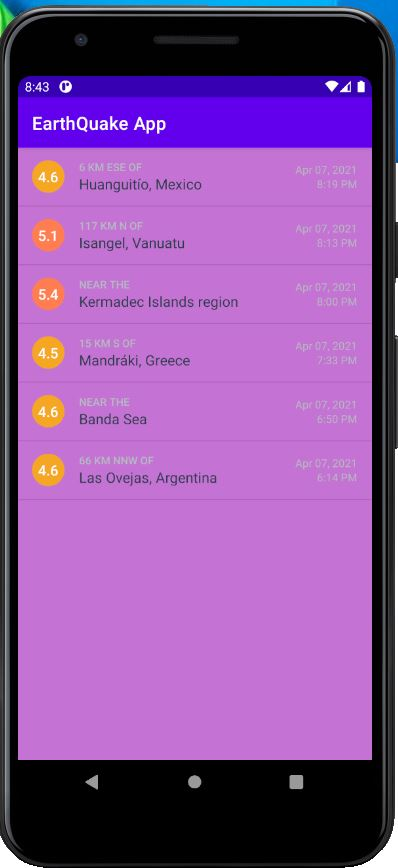
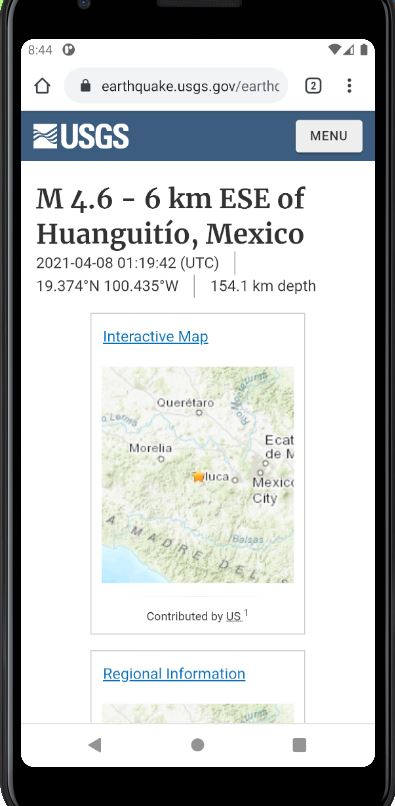

# This is my readme for ICP10

In this ICP i have displayed the recent earthquake information Create a mobile application with the following requirements  :
1.On clicking any item Earthquake, the user mustbe directed to the webpage of USGS which contains further information about the earthquake in the web browser. 
2.Follow all the three TODO instructions in the QueryUtils.javafile and two more TODO instructions in the EarthquakeActivity.javafile and AndroidManifest.xml.

# OUTPUTS

1. Initial screen when the android studio is executed
     

2. When we get the earthquake list we select one of the link and we get the details regarding the selected earthquake
     
