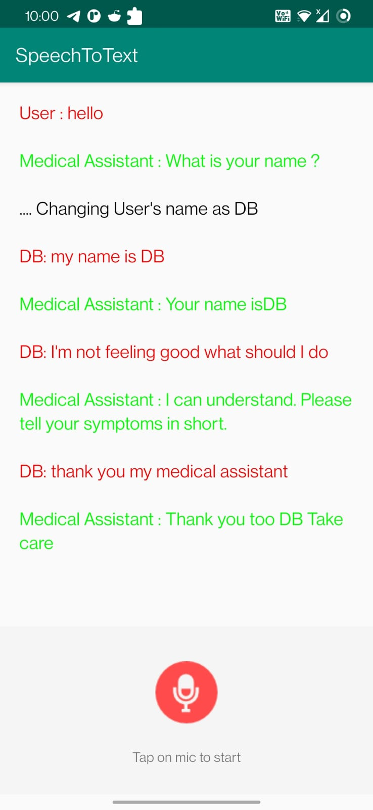

# This is my readme for ICP 13 

In this ICP i got to know about the speech to text and text to speech applications

# Outputs 

1. Initial screen when android studio is executed 

2. The final output after executing the commands as given

