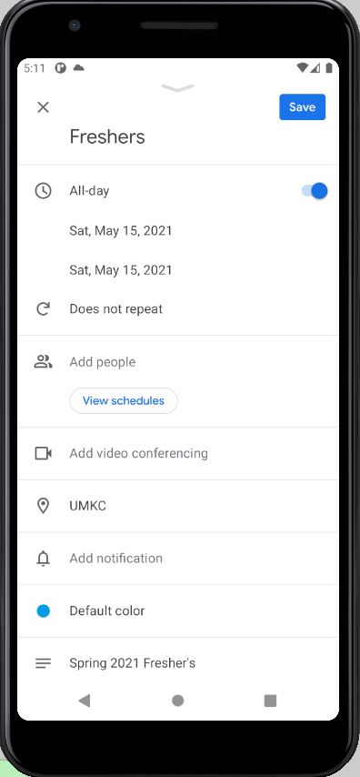

# This is my readme for ICP 14

In this ICP I got to know about Notification, Calendar,and Publishing apps to Google Play Store.

# OUTPUTS

## This is the simple calendar view where we can choose a date to know the events

## Here we do create events manually for the date we wish and save them

## This shows us the overview of our event with timings, location and etc

## This generally shows the events of the coming days where the event we included can aso be viewed among those existing events

## This is to show we interconnect with the google calender

